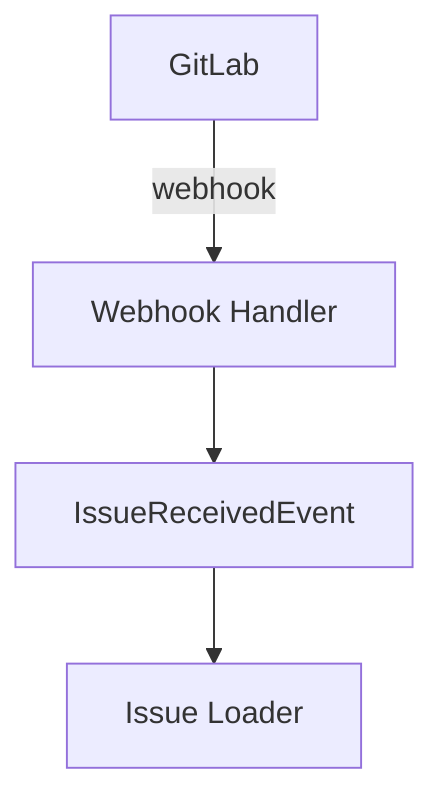
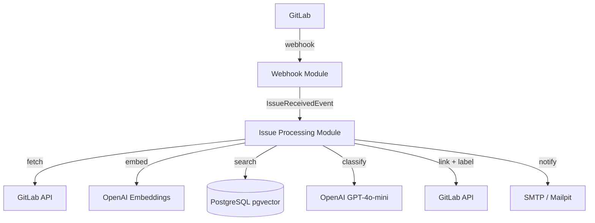

# Lesson 29: Create README

## What We're Building

A comprehensive `README.md` that documents the architecture, local setup, configuration,
and pipeline — the entry point for anyone who encounters the project.

---

## Technologies

### Markdown
README files are written in Markdown — a lightweight markup language that renders on GitHub,
GitLab, and most documentation platforms. Key elements:
- `# Heading 1`, `## Heading 2` — headings
- `**bold**`, `*italic*` — emphasis
- `` `code` `` — inline code
- ```` ```java ``` ```` — code blocks with syntax highlighting
- `[link text](url)` — hyperlinks
- `` — images

### Mermaid Diagrams
GitHub and GitLab render Mermaid diagrams natively inside Markdown code blocks.
Use them for architecture diagrams and flow charts without external tools:

````markdown

````

---

## Step-by-Step

### Step 1: Structure the README

A good README for a technical project covers:
1. **What it does** — one paragraph, no jargon
2. **Architecture** — diagram + brief module descriptions
3. **Quick start** — get it running in under 5 commands
4. **Configuration reference** — all required env variables
5. **Pipeline description** — what happens step by step
6. **Development guide** — running tests, common tasks

### Step 2: Write the README

````markdown
# AI Issue Deduplicator

Automatically detects duplicate and related issues in GitLab using vector embeddings
and LLM classification. When a new issue is created or updated, the service finds similar
existing issues and creates links between them, adds labels, and notifies the author by email.

## Architecture



### Modules

| Module | Responsibility |
|--------|----------------|
| `webhook` | Receive GitLab webhooks, validate token, publish domain events |
| `gitlab` | GitLab API client, issue loading |
| `issue-processing` | Orchestrate the full pipeline |
| `similarity` | Embedding generation, pgvector search, candidate ranking |
| `classification` | LLM-based issue pair classification |
| `notification` | Email notifications |
| `observability` | Custom metrics, tracing |
| `shared` | Common types, persistence entities |

## Quick Start

### Prerequisites
- Docker and Docker Compose
- Java 25
- OpenAI API key
- GitLab personal access token

### 1. Clone and configure

```bash
git clone https://github.com/your-org/ai-issue-deduplicator
cd ai-issue-deduplicator
cp .env.example .env
# Edit .env and add your API keys
```

### 2. Start infrastructure

```bash
docker compose up -d
```

Services started:
- PostgreSQL + pgvector: `localhost:5432`
- pgAdmin: `http://localhost:5050`
- Mailpit: `http://localhost:8025`

### 3. Run the application

```bash
./mvnw spring-boot:run
```

Application starts on `http://localhost:8080`.

## Configuration

All secrets must be provided as environment variables (never commit them):

| Variable | Description | Example |
|----------|-------------|---------|
| `OPENAI_API_KEY` | OpenAI API key | `sk-...` |
| `GITLAB_PRIVATE_TOKEN` | GitLab personal access token | `glpat-...` |
| `GITLAB_WEBHOOK_SECRET` | Secret configured in GitLab webhook settings | `my-secret` |

Optional configuration in `application.yml`:

| Property | Default | Description |
|----------|---------|-------------|
| `similarity.minimum-threshold` | `0.75` | Minimum cosine similarity to consider a candidate |
| `similarity.top-k` | `10` | Maximum candidates to retrieve from vector search |

## GitLab Webhook Setup

1. In your GitLab project: Settings → Webhooks → Add new webhook
2. URL: `http://your-server:8080/api/webhooks/gitlab/issues`
3. Secret token: value of `GITLAB_WEBHOOK_SECRET`
4. Trigger: **Issues events** only
5. Click "Add webhook"

## Pipeline

```
GitLab issue created/updated
  → POST /api/webhooks/gitlab/issues
  → token validated → 200 OK returned immediately
  → IssueReceivedEvent published to Event Publication Registry
  → [async] Issue loaded from GitLab API
  → Embedding generated (OpenAI text-embedding-3-small)
  → Issue stored in PostgreSQL (upsert)
  → Top-10 similar issues found (pgvector HNSW cosine search)
  → Candidates ranked and filtered (threshold: 0.75)
  → Each candidate classified by LLM (GPT-4o-mini)
  → For DUPLICATE: GitLab link created, 'duplicate-detected' label added, email sent
  → For RELATED: GitLab link created, email sent
```

## Development

### Run tests
```bash
./mvnw test                    # unit tests only
./mvnw verify                  # unit + integration tests (requires Docker)
```

### View emails
Open Mailpit at `http://localhost:8025` during development.

### View traces
Open Jaeger at `http://localhost:16686` (if running Jaeger container).

### API documentation
Open `http://localhost:8080/swagger-ui.html`.

### Health check
```bash
curl http://localhost:8080/actuator/health
```
````

### Step 3: Create `.env.example`

```bash
# Copy this to .env and fill in your values
OPENAI_API_KEY=sk-your-key-here
GITLAB_PRIVATE_TOKEN=glpat-your-token-here
GITLAB_WEBHOOK_SECRET=choose-a-strong-secret
```

---

## Practical Tips

**Write the README for someone who has never seen the project.** Imagine a new team member
joins and opens the repo. They should be able to run it locally within 10 minutes using
only the README. Test this by following the README yourself after finishing it.

**Keep the quick start truly quick.** The "Quick Start" section should be under 5 steps.
Move anything non-essential (detailed config options, troubleshooting, advanced usage)
to a separate `docs/` folder.

**Update the README when the code changes.** Stale documentation is worse than no
documentation — it wastes time. Make README updates part of your definition of done
for every feature.

**Use the Mermaid live editor** at `mermaid.live` to iterate on diagrams. You can see
the rendered result immediately, then paste the source into the README.

**Add a badge for build status.** On GitHub:
```markdown

```
This gives readers immediate confidence about whether the project is in a working state.
